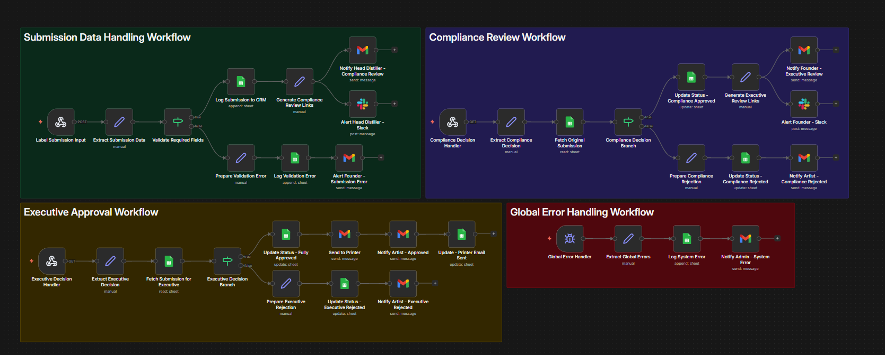

# 🥃 Barrel & Bolt: Custom Spirit Label Compliance & Approval Automation



## Overview

This n8n automation system manages the end-to-end compliance review and executive
approval pipeline for custom spirit label submissions at **Barrel & Bolt**. When an
artist or label designer submits a new custom spirit label, the system automatically
validates the submission, routes it through a structured two-stage review process
(Compliance → Executive), notifies all relevant stakeholders at each stage, and
triggers print dispatch upon final approval — all with centralized error monitoring.

The automation is composed of **four interconnected sub-workflows**, each handling a
distinct phase of the label approval lifecycle.

---

## 🗂️ Workflow Architecture

| Sub-Workflow | Trigger | Primary Function |
|---|---|---|
| Submission Data Handling | Webhook (POST) | Intake, validate, and log new label submissions |
| Compliance Review | Webhook (GET) | Process compliance decisions and route accordingly |
| Executive Approval | Webhook (GET) | Process executive decisions and dispatch to printer |
| Global Error Handling | Error Trigger | Catch, log, and alert on system-wide failures |

---

## ⚙️ Sub-Workflow Breakdown

### 1. 📥 Submission Data Handling Workflow

Handles the initial intake of a new label submission from an external form or API call.

**Flow:**
1. **Label Submission Input** — Receives POST webhook from label submission form
2. **Extract Submission Data** — Parses and normalizes incoming payload fields
3. **Validate Required Fields** — Checks for completeness of mandatory label data

**On Validation Success:**
- Logs submission to CRM (Google Sheets append)
- Generates compliance review links
- Notifies Head Distiller via **Gmail** with review link
- Sends alert to Head Distiller via **Slack**

**On Validation Failure:**
- Prepares a structured validation error response
- Logs the error to Google Sheets
- Notifies Founder via Gmail with submission error details

---

### 2. 🔍 Compliance Review Workflow

Processes the compliance officer's decision once the Head Distiller has reviewed the label.

**Flow:**
1. **Compliance Decision Handler** — Receives GET webhook with compliance decision
2. **Extract Compliance Decision** — Parses approval/rejection flag and notes
3. **Fetch Original Submission** — Reads original submission data from Google Sheets
4. **Compliance Decision Branch** — Routes based on approval or rejection outcome

**On Compliance Approved:**
- Updates submission status to *Compliance Approved* in Google Sheets
- Generates executive review links
- Notifies Founder via Gmail for executive review
- Sends alert to Founder via Slack

**On Compliance Rejected:**
- Prepares structured rejection message
- Updates submission status to *Compliance Rejected* in Google Sheets
- Notifies Artist via Gmail with rejection details

---

### 3. ✅ Executive Approval Workflow

Handles the final executive-level approval decision and triggers downstream print dispatch.

**Flow:**
1. **Executive Decision Handler** — Receives GET webhook with executive decision
2. **Extract Executive Decision** — Parses final approval or rejection outcome
3. **Fetch Submission for Executive** — Retrieves full submission record from Google Sheets
4. **Executive Decision Branch** — Routes based on final decision outcome

**On Executive Approved:**
- Updates submission status to *Fully Approved* in Google Sheets
- Sends label file to Printer via Gmail
- Notifies Artist of approval via Gmail
- Updates Google Sheets to confirm printer email was sent

**On Executive Rejected:**
- Prepares structured executive rejection message
- Updates submission status to *Executive Rejected* in Google Sheets
- Notifies Artist via Gmail with final rejection details

---

### 4. 🚨 Global Error Handling Workflow

A system-wide safety net that captures unhandled errors from any of the above workflows.

**Flow:**
1. **Global Error Handler** — Catches errors triggered across all sub-workflows
2. **Extract Global Errors** — Parses error context, source workflow, and stack trace
3. **Log System Error** — Appends error record to Google Sheets error log
4. **Notify Admin — System Error** — Sends error notification to system admin via Gmail

---

## 🛠️ Tech Stack & Integrations

| Tool / Service | Usage |
|---|---|
| **n8n** | Core workflow automation platform |
| **Google Sheets** | CRM logging, status tracking, and error logging |
| **Gmail** | Stakeholder notifications (Head Distiller, Founder, Artist, Printer, Admin) |
| **Slack** | Real-time alerts for Head Distiller and Founder |
| **Webhooks** | Submission intake and decision callbacks |

---

## 👥 Stakeholder Notification Map

| Event | Notified Party | Channel |
|---|---|---|
| New submission received | Head Distiller | Gmail + Slack |
| Submission validation failed | Founder | Gmail |
| Compliance approved | Founder | Gmail + Slack |
| Compliance rejected | Artist | Gmail |
| Executive approved | Artist + Printer | Gmail |
| Executive rejected | Artist | Gmail |
| System error detected | Admin | Gmail |

---

## 🔄 End-to-End Process Flow

```
Artist Submits Label
        │
        ▼
[Submission Data Handling]
   Validate & Log to CRM
        │
        ├── ❌ Invalid → Notify Founder (Error)
        │
        ▼ ✅ Valid
   Notify Head Distiller (Gmail + Slack)
        │
        ▼
[Compliance Review]
   Head Distiller Reviews Label
        │
        ├── ❌ Rejected → Notify Artist (Compliance Rejected)
        │
        ▼ ✅ Approved
   Notify Founder for Executive Review (Gmail + Slack)
        │
        ▼
[Executive Approval]
   Founder Makes Final Decision
        │
        ├── ❌ Rejected → Notify Artist (Executive Rejected)
        │
        ▼ ✅ Approved
   Send to Printer + Notify Artist ✅

[Global Error Handler] ← monitors all stages → Notify Admin
```

---

## 📁 Project Structure

```
barrel-bolt-label-automation/
├── README.md
└── assets/
    └── Barrel-Bolt-Custom-Spirit-Label-Automation-Workflow.jpg
```

---

## 🚀 Setup & Deployment

### Prerequisites
- n8n instance (self-hosted or cloud)
- Google Sheets API credentials configured in n8n
- Gmail OAuth2 credentials configured in n8n
- Slack Bot Token configured in n8n

### Steps
1. Import each workflow JSON into your n8n instance
2. Configure credentials for Google Sheets, Gmail, and Slack
3. Activate **Global Error Handling** workflow first
4. Activate remaining workflows in order:
   - Submission Data Handling
   - Compliance Review
   - Executive Approval
5. Copy webhook URLs and configure them in your submission form and review interfaces
6. Test end-to-end with a sample label submission

---

## 📌 Notes

- All submission records and status updates are centralized in a single Google Sheet
  for full audit traceability
- The two-stage review process (Compliance → Executive) ensures quality control
  before any label reaches production
- Error logging captures workflow name, node name, and error message for rapid debugging
- Slack alerts provide real-time visibility without requiring stakeholders to check email

---

*Built with ❤️ using [n8n](https://n8n.io) — Workflow Automation Platform*
